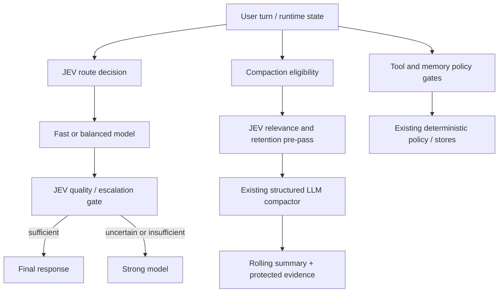

# JEV decision layer for the agent harness

Status: **Stages 1–9 implemented; active compaction/memory evidence is green under calibrated limits; global default-on remains off**
Scope: `agent-driver` runtime, SDK, context compaction, tool governance, and
evaluation harness.
Owner: runtime/model-routing workstream.

Stage 1 now has an opt-in implementation: a typed OpenRouter Decisions adapter,
`JevTierRouter`, raw-free route metadata, deterministic fallback behavior, and
focused offline tests. Default-on rollout still requires live smoke evidence and
the replay comparison described in Stage 5.

Stage 2 now adds an opt-in `JevQualityGate`. It evaluates a bounded candidate
answer, can request one repair/tool continuation or one escalation to the
`strong` role, and records only typed decision metadata and usage. It also has a
single bounded recovery classification for malformed tool calls and tool
failures. Existing tool-policy, retry, budget, and force-final guards remain
authoritative; without a configured gate, behavior is unchanged.

Stage 3 now adds an opt-in `JevCompactionPrepass`. It batches bounded,
message-level transcript units into one typed JEV request, protects deterministic
evidence, archives only high-confidence low-relevance units, and hands the
remaining view to the existing compactor. A raw-free `compaction_prepass`
receipt records decisions, hashes, reduction, usage, and fail-open reasons.

The first synthetic benchmark is available as
`agent_driver.evals.jev_compaction_benchmark`: it compares baseline, an offline
oracle stub, and forced fallback, then optionally runs the same fixtures against
OpenRouter. Reports are written as raw-free Markdown and JSONL/JSON artifacts.

The calibrated live checkpoint is recorded in
`artifacts/jev-compaction/live-final/report.md` (two repeats, five scenarios,
baseline/JEV/forced-fallback). With `min_confidence=0.55`,
`archive_probability=0.70`, and `archive_relevance_max=1.5`, JEV archived the
labelled completed-noise blocks with 100% precision and recall, reduced the
compactor input by 80.5–83.6%, and preserved protected facts and exact answer
fields in every live row. Low-confidence units are retained verbatim using
`retain_relevance_min=2.0` and `retain_probability=0.55`. The no-pressure
control made no decision call; the uncertain scenario archived nothing. The
feature remains opt-in pending a larger replay corpus and shadow-mode review.

Stage 4 now provides an opt-in `MemoryDurabilityGate` for the existing fact
extraction provider. It classifies bounded candidates as durable, session-only,
obsolete, sensitive, or uncertain, checks durable candidates against existing
memory for contradictions, rejects sensitive candidates before the decision
request, and persists only accepted durable facts. Accepted records carry a
stable `fact_id`, `source_ref`, and durable scope; the runtime projects a
raw-free gate receipt and usage into `memory_durability` metadata. Gate
failures hold candidates and never fall back to durable raw-turn writes.

Stage 5 now provides a replay corpus and rollout evidence layer in
`agent_driver.evals.jev_stage5`. It covers routing, escalation, tool safety,
compaction, corrections, multilingual turns, and long tool histories; it also
calibrates separate initial thresholds per gate and emits raw-free readiness
reports. `JevRolloutSettings` supports `off`, `shadow`, and `active` modes with
per-gate/per-task overrides, pinned model ids, and bounded automatic rollback on
fallback-rate or cost breaches.

The current live checkpoint is aggregated at
`artifacts/jev-stage5/live-final/report.md`: 10 compaction JEV rows across two
repeats, 100% exact answer-field accuracy, 100% protected-fact recall, zero
observed compaction fallbacks, and 49.2% mean compactor-input reduction.
The cross-surface runtime check is recorded at
`artifacts/jev-stage5/live-validation/report.md`. It runs seven cases twice
through production hooks, makes 14 live JEV calls, replays each typed answer
once from shadow into active, and reports 100% decision accuracy, zero
fallbacks, valid rollback recovery, unchanged shadow behavior, and preserved
tool-policy/memory invariants. The resulting Stage 5 report has no coverage
gaps, records the live chat-demo check, and recommends `active_low_risk`.
Global default-on remains an explicit operator choice.

The deterministic chat-demo backend check is recorded at
`artifacts/jev-stage5/chat-demo-check.json` (`4 passed`: health, SSE, and
observability). It confirms the integration surface and raw-free event path;
the provider-backed active smoke is recorded at
`artifacts/jev-stage5/chat-demo-live-check.json`; the demo's global default
rollout is still off by design.

## Goal

Add a decision-model control plane to the harness. JEV should make bounded,
typed decisions about routing, escalation, tool safety, context retention, and
memory durability. Generative models remain responsible for writing answers,
planning, tool use, and producing summaries.

The first delivery deliberately excludes open-ended conversation clustering.
The raw transcript and provenance remain durable throughout all phases.

## Operating principles

1. **Decision models choose from a contract.** Every call has an explicit
   `state` and typed questions (`choice`, `score`, or `noul`). The harness maps
   the answer to a known action; it never executes a model-provided arbitrary
   command or model ID.
2. **Policy stays above the model.** JEV may recommend escalation, approval, or
   retention. It may never weaken a static deny rule or authorize a forbidden
   side effect.
3. **Uncertainty is an outcome.** Low confidence, missing fields, a timeout, or
   an invalid response falls back to the existing deterministic behavior or to
   a stronger model. It must not silently become `allow`, `drop`, or `final`.
4. **Route roles, not a live catalog.** The harness keeps a small configured
   set of semantic roles such as `fast`, `balanced`, and `strong`. A role maps
   to a concrete provider/model through the existing role registry.
5. **Protect exact evidence.** User instructions, decisions, unresolved errors,
   file paths, commands, artifact references, and provenance are retained even
   when a relevance classifier is uncertain.
6. **Pin and observe.** Production uses a pinned decision-model build. Every
   decision records model version, request ID, latency, cost, question schema
   version, answer, and confidence without storing raw sensitive state in the
   trace.

## Target control flow



## Stage 0 — decision contract and provider substrate

### Work

- Add a small decision-provider contract separate from chat completion:
  `decide(state, questions, model) -> DecisionResponse`.
- Define typed contracts for:
  - `DecisionQuestion` (`choice`, `score`, `noul`);
  - `DecisionAnswer` (selected value, probabilities, score, confidence);
  - `DecisionResponse` (model, exact model version, request ID, usage, cost,
    latency, answers);
  - schema/version identifiers for each question set.
- Implement an OpenRouter Decisions API adapter for the configured endpoint and
  model. Validate the response strictly before it reaches runtime code.
- Add bounded timeout, retry, rate-limit, and circuit-breaker behavior. A
  decision failure must return a typed fallback outcome rather than raise into
  the agent loop.
- Integrate usage into the existing cost ledger and emit redaction-safe runtime
  decision events.
- Add a fake decision provider for deterministic unit tests and an opt-in live
  smoke check.
- Pin the initial production decision model; keep a rolling alias available only
  for experiments.

### Exit criteria

- A fake decision can be replayed from a fixture and produces the same typed
  answer and trace metadata.
- Malformed, missing, or unexpected answer types fail closed.
- Timeout, provider error, and rate-limit paths are bounded and observable.
- Decision cost is visible in the run receipt without raw prompt/state content.

## Stage 1 — JEV model-tier routing

### Work

- Implement `JevTierRouter` using the existing `AsyncModelRouter` seam.
- Start with three configured roles:
  - `fast`: short, low-risk, one-step work;
  - `balanced`: normal agent turns and moderate tool use;
  - `strong`: planning, debugging, design, refactoring, ambiguity, and
    high-impact work.
- Send JEV a bounded request envelope rather than the full transcript:
  latest user request, run phase, tool/risk class, context pressure, remaining
  budget, and candidate role descriptions.
- Ask one `choice` question for the tier and one `noul` question for whether
  strong reasoning is required. Map the result to `model_role_map`.
- Reuse the selected role across the inner tool loop. Re-evaluate only at an
  explicit user-turn or escalation boundary so the model does not oscillate.
- Apply deterministic floors before accepting the result: high-risk actions,
  unresolved contradictions, or explicit deep-reasoning requests cannot route
  to `fast`.
- Preserve the current heuristic router as a no-network fallback.

### Exit criteria

- Existing runs behave identically when JEV routing is disabled.
- The selected role, fallback reason, and JEV confidence appear in the trace.
- Routing tests cover simple, complex, ambiguous, high-risk, timeout, and
  malformed-response cases.
- Offline replay shows lower cost or latency at the same accepted-answer rate
  before enabling the feature by default.

## Stage 2 — quality-gated escalation and runtime control decisions

### Work

- Add a post-response decision gate for cheap or balanced routes:
  - is the answer sufficient for the request?
  - is more tool work required?
  - is the answer grounded in available evidence?
  - is the run blocked or ready to finalize?
- On a negative or low-confidence result, allow one bounded escalation to the
  strong role. Preserve the original answer and the gate decision in the trace.
- Add a retry/repair classifier for malformed tool calls, repeated tool failure,
  and provider recoveries. Keep deterministic retry limits authoritative.
- Add an ambiguity gate for asking the user a question. Only use it when the
  ambiguity is material to the result and the existing clarification policy
  allows an interruption.
- Keep all gates advisory to the static policy layer. A JEV answer can tighten
  `allow` to `ask`/`deny`, but cannot loosen a static `deny`.

### Exit criteria

- A cheap answer can be escalated once without duplicating side effects.
- Finalization never depends on an unvalidated free-text judgment.
- Gate decisions are replayable, bounded, and visible in support bundles.
- Tests prove that policy denies and irreversible-operation safeguards cannot be
  bypassed by JEV.

## Stage 3 — JEV pre-pass for context compaction

### Work

- Run the pre-pass only when the existing compaction eligibility logic says that
  compaction is needed. Do not add a decision call to every ordinary turn.
- Segment history into semantic units: user/assistant exchange, tool call plus
  result, plan update, error/evidence block, or artifact update.
- Build an active-state envelope from the current request, open goals, active
  plan, unresolved errors, protected artifact references, and the last turn.
- Batch several questions for each unit in one decision request:
  - relevance to the active goal (`score`);
  - new user constraint or decision (`noul`);
  - contradiction with current state (`noul`);
  - safe to remove after summarization (`noul`);
  - optional evidence/durability flag (`noul`).
- Introduce explicit retention classes:
  - **protected** — exact instructions, decisions, errors, paths, commands,
    artifacts, and provenance;
  - **retain** — directly relevant units;
  - **summarize** — useful but not needed verbatim;
  - **archive** — low-relevance units whose source remains available.
- Feed retained and summarize-class units to the existing structured LLM
  compactor. Keep the current rolling-summary carry-forward contract.
- Store the pre-pass receipt: unit IDs, decisions, thresholds, dropped hashes,
  and fallback reason. Never store raw sensitive state in the receipt.
- On JEV failure, use the current compaction path unchanged, subject to its
  existing circuit breaker.

### Exit criteria

- Exact protected facts survive compaction in deterministic and adversarial
  fixtures.
- The pre-pass reduces compaction input without reducing answer quality.
- A provider failure or low-confidence result keeps more context rather than
  deleting it.
- Metrics exist for token reduction, protected-fact recall, compaction latency,
  decision cost, and fallback rate.

## Stage 4 — memory durability and evidence gates

### Work

- Before session-memory extraction, classify candidate facts as:
  durable, session-only, obsolete, sensitive, or uncertain.
- Store only durable candidates by default, with source-turn references and the
  decision receipt. Hold uncertain candidates outside the durable store and
  expose session-only/held counts in the receipt.
- Add a contradiction check before merging a new fact into existing memory.
- Reuse the same decision substrate and cost accounting as routing and
  compaction; do not create independent ad-hoc provider calls.
- Add retention and redaction tests for secrets, personal data, transient
  errors, and user corrections.

### Exit criteria

- Durable memory never loses its source reference.
- Conflicting facts are held for resolution rather than silently merged.
- Sensitive or transient content does not become long-lived memory by default.

## Stage 5 — evaluation, rollout, and operational hardening

### Work

- Create a replay corpus covering routing, escalation, tool safety, compaction,
  corrections, multilingual turns, and long tool histories.
- Record baseline and JEV-enabled runs with the same inputs and deterministic
  seeds where possible.
- Track:
  - accepted-answer quality;
  - escalation and fallback rates;
  - latency and cost per completed run;
  - context-token reduction;
  - protected-fact and source-reference recall;
  - false `drop`, false `final`, and false `allow` decisions.
- Run `python -m agent_driver.evals.jev_compaction_benchmark --live` with a
  bounded scenario/repeat budget and review the generated report before changing
  the retention thresholds.
- Calibrate thresholds separately for routing, retention, escalation, and
  memory. Do not reuse one global confidence threshold.
- Add feature flags and per-task configuration. Roll out first in shadow mode,
  then to low-risk tasks, then to normal chat.
- Pin the decision-model build in production and log the exact returned version.
- Document the live smoke command, provider limits, cost budget, and rollback
  behavior.

The Stage 5 report can be generated from an existing bounded live benchmark:

```bash
python -m agent_driver.evals.jev_compaction_benchmark --live --repeats 2 \
  --output artifacts/jev-compaction/live-final
python -m agent_driver.evals.jev_stage5 \
  --input-results artifacts/jev-compaction/live-final/results.json \
  --live-validation artifacts/jev-stage5/live-validation/report.json \
  --chat-demo-check artifacts/jev-stage5/chat-demo-live-check.json \
  --output artifacts/jev-stage5/live-final
```

The cross-surface runtime smoke is:

```bash
python -m agent_driver.evals.jev_live_validation --live --repeats 2 \
  --output artifacts/jev-stage5/live-validation
```

It uses the pinned `AGENT_DRIVER_JEV_MODEL`, reads the OpenRouter key from the
local environment, and writes raw-free JSON/Markdown. Each case has an `off`,
`shadow`, and `active` treatment. `off` makes no decision call; `shadow` calls
JEV but keeps the existing route, finalization, tool denial, or memory write;
`active` replays the same typed answer through the applying hook. The harness
does not claim generation answer quality or independent active latency because
those require a full chat turn; the compaction benchmark remains the semantic
quality check.

### Exit criteria

- Shadow mode produces a reviewable decision report without changing behavior.
- Each enabled gate has a measured fallback and rollback path.
- Default-on requires a green replay suite and an explicit live chat-demo check.

## Stage 6 — controlled canary rollout and production calibration

Stage 6 turns the Stage 5 evidence into an operator-facing canary decision. The
initial policy is task-scoped to `normal_chat`: routing and quality may run in
`active`, while compaction and memory remain in `shadow`. The canary is bounded
by a sample budget, fallback-rate limit, p95 decision latency, cost per decision,
minimum decision accuracy, runtime invariants, unchanged shadow behavior, and
paired replay checks. `JevRolloutController` records latency p95 and rolls every
JEV gate back to `off` when a configured SLO is breached.

Run the bounded canary and aggregate its raw-free artifacts with:

```bash
python -m agent_driver.evals.jev_live_validation --live --repeats 3 \
  --output artifacts/jev-stage6/live-validation
python -m agent_driver.evals.jev_stage6 \
  --live-validation artifacts/jev-stage6/live-validation/report.json \
  --stage5-report artifacts/jev-stage5/live-final/report.json \
  --chat-demo-check artifacts/jev-stage5/chat-demo-live-check.json \
  --output artifacts/jev-stage6/canary
```

The canary labels are used to calibrate per-gate confidence thresholds, but are
marked `live_canary_oracle` until production outcome labels replace them. A
failed SLO keeps the recommendation at `shadow` and records the exact rollback
reason; it does not silently broaden the rollout.

The current three-repeat run produced 21 decision calls with 100% decision
accuracy, zero fallbacks, complete invariants and paired replay, and mean cost
of about `$0.0000307` per decision. The measured p95 was `5583.33 ms`, above
the initial `5000 ms` canary limit, so promotion remains held for latency
calibration. Routing and quality thresholds have enough live labels; compaction
and memory remain evidence-gated because this canary intentionally exercises
them only in shadow.

### Exit criteria

- A bounded task allowlist has a reproducible canary artifact and rollback path.
- Accuracy, fallback, p95 latency, cost, invariants, and shadow parity are all
  green before active promotion.
- Threshold calibration records its label source and does not claim production
  readiness from a synthetic or pre-production oracle.
- Compaction and memory are promoted only after their own active evidence is
  collected.

## Stage 7 — production observability and latency calibration

The decision transport now keeps a bounded, raw-free telemetry window. Each
decision records outcome, attempts, status code, cost-known/unknown state,
connection count, total latency, and phase timing for client setup, TCP/TLS,
response headers/body, retry wait, and decode/validation. Failed and cancelled
calls are counted too. The chat-demo health endpoint exposes rollout status and
the bounded JEV transport snapshot when JEV is configured.

Production bundles reuse one `httpx.AsyncClient` connection pool. The runtime
rollout is now a `JevRolloutController`, so fallback, cost, and p95 latency
breaches actually disable the gates instead of merely being configured on an
immutable settings object.

Compare fresh transport variants with:

```bash
python -m agent_driver.evals.jev_live_validation --live --repeats 2 \
  --output artifacts/jev-stage7/baseline
python -m agent_driver.evals.jev_live_validation --live --repeats 2 \
  --reuse-connections --output artifacts/jev-stage7/pooled
python -m agent_driver.evals.jev_stage7 \
  --baseline artifacts/jev-stage7/baseline/report.json \
  --pooled artifacts/jev-stage7/pooled/report.json \
  --output artifacts/jev-stage7/latency
```

The current comparison reduced observed p95 from `6245.37 ms` in the
new-connection variant to `1680.18 ms` with pooling in the telemetry window;
mean latency fell from `2169.31 ms` to `850.74 ms`. The pooled run had
100% decision accuracy, zero fallbacks, complete cost accounting, and met the
`5000 ms` target. The baseline had one transport failure, which is preserved as
an operational signal rather than hidden; it does not block selecting the
healthy pooled candidate.

### Exit criteria

- Runtime telemetry is bounded, raw-free, and available through health or an
  equivalent operator endpoint.
- Failed calls and unknown billing outcomes are visible and included in SLO
  decisions.
- The selected transport meets the p95, fallback, cost, and invariant gates on
  a repeatable canary.
- Production outcome labels remain required before global default-on.

## Stage 8 — production labels and gradual rollout promotion

Stage 8 adds a deduplicated append-only `jev-production-label.v1` ledger. A
label contains only a decision id, gate, bounded task category, correctness and
safety outcomes, fallback, latency, cost, source, and rollout window. It cannot
contain prompts, answers, transcript text, or credentials. The chat-demo health
payload reports only ledger count, windows, and label sources.

`agent_driver.evals.jev_stage8` applies separate evidence gates to routing,
quality, compaction, and memory. Each gate needs at least five reviewed labels
across two windows, 98% accuracy, no more than 2% fallback, passing safety,
p95 below 5000 ms, and cost below `$0.0001` per decision. Stage transitions are
monotonic and explicit:

```text
shadow -> low_risk_active -> normal_chat_canary -> default_on
```

The final transition always requires an operator approval flag; labels alone
cannot enable global default-on. Compaction and memory remain held until their
own active production evidence exists.

Evaluate the ledger with:

```bash
python -m agent_driver.evals.jev_stage8 \
  --labels .agent-driver/jev-production-labels.jsonl \
  --stage7-report artifacts/jev-stage7/latency/report.json \
  --output artifacts/jev-stage8/promotion
```

The empty production ledger correctly recommends `shadow` with reason
`no_production_labels`. A separate three-window reviewed-canary rehearsal
produced 18 labels (routing=6, quality=12) and recommends
`normal_chat_canary`; compaction and memory remain held. These reviewed-canary
labels demonstrate the promotion path but are not claimed as end-user
production outcomes.

### Exit criteria

- Production labels are durable, deduplicated, raw-free, and auditable by
  window and gate.
- Low-risk gates can be promoted only after independent reviewed labels and a
  green transport report.
- Normal chat remains task-allowlisted during canary promotion.
- Global default-on requires explicit operator approval plus green evidence for
  every enabled gate.

## Stage 9 — active compaction and memory evidence

Stage 9 closes the two held-gate evidence gaps with fresh active runs. The
memory validation uses the production durability hook and checks durable-write,
provenance, and sensitive-redaction invariants. The compaction validation runs
the production pre-pass, structured summarizer, and answer check over two
windows; a no-pressure control is excluded because it makes no JEV decision.
Only bounded outcome labels are emitted from these reports. No prompt, answer,
transcript, request body, or credential is copied into the label ledger.

Run the active evidence and aggregate it with the existing routing/quality
review labels:

```bash
python -m agent_driver.evals.jev_live_validation --live --repeats 5 \
  --reuse-connections --output artifacts/jev-stage9/live-validation
python -m agent_driver.evals.jev_compaction_benchmark --live --repeats 2 \
  --output artifacts/jev-stage9/compaction-live
python -m agent_driver.evals.jev_stage9 \
  --compaction-report artifacts/jev-stage9/compaction-live/results.json \
  --memory-report artifacts/jev-stage9/live-validation/report.json \
  --routing-quality-labels artifacts/jev-stage8/reviewed-canary-labels.jsonl \
  --stage7-report artifacts/jev-stage7/latency/report.json \
  --output artifacts/jev-stage9/active-evidence
```

The current run produced eight compaction labels across two windows and five
memory labels across five windows. Both gates had 100% reviewed correctness,
zero fallbacks, complete safety invariants, and complete cost telemetry.
Compaction JEV p95 was 19.31 seconds with mean decision cost `$0.0002676`;
memory p95 was 4.81 seconds with mean cost `$0.0000679`. Compaction therefore
uses an explicit calibrated budget of 30 seconds and `$0.0004` per batched
decision, rather than inheriting the cheaper routing/quality budget. The
promotion report is a `normal_chat_canary` candidate with
`operator_approval_required=true`; the runtime still keeps global default-on
disabled and leaves the final switch to an operator.

The artifacts are:

- `artifacts/jev-stage9/compaction-live/report.md` — raw-free semantic
  compaction run and its controls;
- `artifacts/jev-stage9/live-validation/report.md` — five-repeat active memory
  and runtime invariant validation;
- `artifacts/jev-stage9/active-evidence/report.md` and
  `active-evidence-labels.jsonl` — the evidence gate and deduplicated labels.

Stage 9 does not claim that these reviewed canary labels are end-user
production outcomes. A later operational step must ingest independently
reviewed production labels, monitor the calibrated compaction latency budget,
and obtain explicit approval before any default-on change.

## Deferred — conversation topic clustering

Do not implement this in the first delivery. Revisit after the routing and
compaction metrics are stable.

The later design should combine retrieval with JEV rather than ask JEV to invent
an unlimited taxonomy:

1. embeddings or lexical search retrieve a small set of candidate clusters;
2. JEV chooses an existing cluster, `none`, or `new_topic`;
3. a generative model names and summarizes a new cluster;
4. each cluster retains open tasks, decisions, last-seen time, confidence, and
   source references;
5. a new user question reactivates only the relevant clusters and expands the
   search when JEV is uncertain or detects a contradiction.

The append-only raw transcript remains the recovery source for every cluster.

## Explicit non-goals

- Replacing the existing generative compactor with JEV.
- Selecting arbitrary model IDs directly from an unbounded OpenRouter catalog.
- Treating JEV confidence as a guarantee that a target LLM will succeed.
- Allowing a decision response to bypass static security or permission policy.
- Deleting raw conversation data because a classifier marked it irrelevant.
- Building open-ended topic clustering before routing and compaction have
  production metrics.

## References

- [OpenRouter: What Is Jev?](https://openrouter.ai/blog/insights/what-is-jev/)
  — Decisions API shape, `choice`/`score`/`noul`, probabilities, and the
  OpenRouter endpoint used by the initial adapter.
- [OpenRouter decision-model catalog](https://openrouter.ai/models?output_modalities=decisions)
  — current decision-model inventory and capability filter.
- [`agent_driver/llm/model_router.py`](../agent_driver/llm/model_router.py) —
  existing synchronous and asynchronous routing seams.
- [`docs/sdk.md`](sdk.md) and [`docs/aux-fork-substrate.md`](aux-fork-substrate.md)
  — current role routing, auxiliary-model, compaction, cost, and cache rules.
